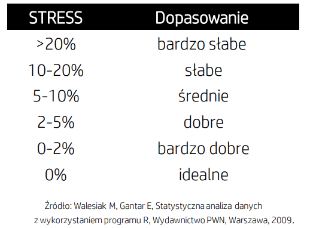

# 1. Cel pracy 
Celem tej pracy jest zastosowanie różnych technik redukcji wielowymiarowośc oraz próba interpretacji uzyskanych wyników. Mam nadzieje, że uda mi się również wskazać metody najbardziej efektywne w kontekście moich danych. Do badania wykorzystam zbiór danych dotyczących różnych czynników wpływających na jakość życia w wybranych państwach świata. Zmienne wykorzystywane do analizy mają za zadanie reprezentować różne sfery życia takie jak zamożność, opieka zdrowotka, edukacja czy ochrona środowiska. Kraje które zostały dobrane są reprezentatywne dla każdego kontynentu oraz obejmują różne kręgi kulturowe, jakie możemy wyróżnić na kuli ziemskiej. Oto ich lista: Algeria, Argentina, Australia, Brazil, Canada, China, Colombia, Egypt, France, Germany, India, Indonesia, Japan, Mexico, New Zealand, Nigeria, Poland, Russia, Saudi Arabia, South Africa, Spain, Sweden, UK, USA. Wszystkie dane obejmują 2022 rok. 

# 2. Wstępna analiza wykorzystywanych danych

Zmienne użyte w badaniu:

- **life_expectancy**: jest to zmienna mówiąca o oczekiwanej długości życia. Jej wysoka wartość świadczy o wysokim poziomie opieki zdrowotnej, odpowiedniej jakości i dostępności jedzenia oraz o dobrym stanie środowiska.

- **dp_per_capita**: Produkt krajowy brutto w przeliczeniu na jedną osobę ($). W jego ustalaniu wzięto pod uwagę zmiany w sile nabywczej pieniądza w danym kraju. Jest to zmienna mówiąca o zamożności danego społeczeństwa. Im wyższa jej wartość, tym kraj jest bogatszy.

- **unemploymnet_rate**: stopa bezrobocia (%). Jej wysoka wartość jest niepożądanym zjawiskiem, świadczy o tym, że na rynku brakuje wolnych stanowisk, co wiąże się z potencjalnym wzrostem ubóstwa w danym kraju.

- **crime_index**: indeks przestępczości, to oszacowanie ogólnego poziomu przestępczości w danym kraju. Im niższa jego wartość, tym potencjalnie w danym kraju jest bezpieczniej.

- **air_quality_index**: wskaźnik opracowany przez agencje rządowe w celu informowania społeczeństwa o obecnym stopniu zanieczyszczenia powietrza lub przewidywanym poziomie jego zanieczyszczenia. Jego wysokie wartości bardzo niekorzystnie wpływają na zdrowie człowieka, szczególnie na jego drogi oddechowe, mogąc w przyszłości prowadzić do wielu powikłań.

- **gini_index**: wskaźnik Giniego (%), oparty na krzywej Lorenza, pokazuje nierówności w dochodach danego społeczeństwa. Należy interpretować go w ten sposób, że im jest wyższy, tym nierówności w dochodach w danym państwie są większe.

- **medical_doctors_per_10000**: liczba lekarzy na 10 000 mieszkańców. Zmienna ta jest niezykle cenna w kontekście interpretowania dostepu do opieki zdrowotnej oraz samej jej jakości w danym kraju.

- **education_index**: indeks edukacji. Jest jednym z komponentów używanych do tworzenia HDI. Bardzo cenny w konkeście określania jakości i dostępności od kształcenia w danym kraju. Im większa jego wartość tym jakość edukacji w danym miejscu jest większa

# 3. Opis danych
```{r, echo = FALSE, results='hide', warning=FALSE, message=FALSE}
# niezbędne biblioteki oraz import danych
library(readxl)
library(MASS)
library(psych)
library(scatterplot3d)
library(corrr)
library(ggcorrplot)
library(ggpubr)
library(knitr)
library(kableExtra)
library(pheatmap)
library(rgl)
library(DT)

df <- read_excel("Projekt_dane.xlsx")
df <- data.frame(df)
names <- df$country
data<- subset(df, select = -country)
rownames(data) <- names
```

## Dane:

```{r, echo=FALSE}
datatable(data, options = list(scrollX = TRUE, scrollY = TRUE))
```


## Podstawowe statystyki:
```{r, echo = FALSE}
means <- round(colMeans(data[c(1,2,3,4,5,6,7,8)]),2)
sd <- round(apply(data[c(1,2,3,4,5,6,7,8)], 2, sd),2)
maxD <- round(apply(data[c(1,2,3,4,5,6,7,8)], 2, max),2)
minD <- round(apply(data[c(1,2,3,4,5,6,7,8)], 2, min),2)
medianD <- round(apply(data[c(1,2,3,4,5,6,7,8)], 2, median),2)
wspZmiennosci <- round(sd/means,2)

t <- data.frame(Mean = means, SD = sd, max = maxD, min = minD, median = medianD, cv = wspZmiennosci)
kable(t, align = "cccccc", digits=2)  %>%
  kable_styling(bootstrap_options = c("striped"),
                full_width = T,
                font_size = 15)
```


Tabela przestawia podstawowe statystyki opisowe odnoszące się do naszych zmiennych. <br>

W przypadku średniej długości życia średnia równa 77,65 jest dość przybliżona do mediany która wynosi 78,35. Odchylenie standardowe wynosi 5,52 lat. Najkrótsze wartości oczekiwanej długości trwania życia można przypisać Nigerii, natomiast największe Japonii. <br>

W przypadku PKB per capita średnia (26670,125) znacznie różni się od mediany (16374,00). Wpływ na to może mieć bardzo wysoka wartość PKB krajów 
najbogatszych w naszym zestawieniu. Najmniejszy dochód krajowy brutto per capita jest w Nigerii, a największy w USA. <br>

W przypadku stopy bezrobocia znów średnia przewyższa medianę. Ma to związek z istniejącymi wartościami odstającymi. Największe wartości przypisujemy Japonii równe 2,6%, a największe RPA równe 33,5%. Odchylenie wynosi 6,3%, a współczynnikk zmienności 0,88. <br>

Indeks przestępczości Ma stosunkowo równe wartości mediany i średniej. Odchylenie standardowe natomiast wynosi 13,46. Największą przestępczości odnotowuje się w Południowej Afryce, a najmniejszą w Japonii. <br>

Indeks jakości powietrza również posiada przybliżone wartości średniej i mediany. Wyraźnie w oczy rzucają się państwa w których wartość indeksy jest największa np. Chiny (96). <br>

Współczynnik Giniego również posiada przybliżoną wartość mediany i średniej. Do państw o największej nierówności społecznej należą: Nigeria (58,8) i Kolumbia (57,8), a najmniejsza nierówność szacowana jest w Niemczech (25,6). <br>

Dwa ostatnie współczynniki mają natomiast bardzo przybliżoną wartość mediany i średniej, co świadczy o ich stosunkowo równym rozkładzie. Odchylenie standardowe w przypadku liczby lekarzy na 10 000 mieszkańcow wynosi 15,73, a przypadku indeksu edukacji 0,14.


## Wykresy pudełkowe dla zmiennych:
```{r, echo = FALSE, fig.align='center'}
pl1 <- ggplot(data=data, aes(y=life_expectancy)) +
  geom_boxplot(fill="lightblue", width=0.5) +
  theme_bw()

pl2 <- ggplot(data=data,aes(y=gdp_per_capita)) +
  geom_boxplot(fill="lightblue", width=0.5)+
    theme_bw()

pl3 <- ggplot(data=data,aes(y=unemploymnet_rate)) +
  geom_boxplot(fill="lightblue", width=0.5)+
  theme_bw()

pl4 <- ggplot(data=data,aes(y=crime_index)) +
  geom_boxplot(fill="lightblue", width=0.5)+
  theme_bw()

pl5 <- ggplot(data=data,aes(y=air_quality_index)) +
  geom_boxplot(fill="lightblue", width=0.5)+
  theme_bw()

pl6 <- ggplot(data=data,aes(y=gini_index)) +
  geom_boxplot(fill="lightblue", width=0.5)+
  theme_bw()

pl7 <- ggplot(data=data,aes(y=medical_doctors_per_10000)) +
  geom_boxplot(fill="lightblue", width=0.5)+
  theme_bw()

pl8 <- ggplot(data=data,aes(y=education_index)) +
  geom_boxplot(fill="lightblue", width=0.5)+
  theme_bw()
ggarrange(pl1,pl2,pl3,pl4,pl5,pl6,pl7,pl8, ncol=4,nrow=2)
```

Powyżej zostały zaprezentowane wykresy pudełkowe dla poszczególnych zmiennych. <br>

Na pierwszym wykresie widzimy dane dotyczące przewidywanej długości życia. Jak łatwo można zauważyć różnica między medianą i pierwszym kwartylem a medianą i czwartym kwartylem jest dość podobna. <br>

W kolejnym wykresie zobrazowana została wartość PKB per capita. Tutaj już mediana jest przybliżona zdecydowanie w stronę pierwszego kwartyla, co oznacza że państw ze wskaźnikiem PKB stosunkowo niskim jest zdecydowanie więcej niż ze wskaźnikiem stosunkowo wysokim. <br>

Trzeci wykres to zobrazowanie stopy bezrobocia w wybranych krajach. Rozmiatr pudełka jest stosunkowo mały. Wynika to z faktu istnienia jedna wartość silnie odstająca od pozostałych. Jest to outlier, który może okazać się kłopotliwy w dalszych etapach analizy <br>

Czwarty wykres odnoszący się do indexu przestępczości jest stosunkowo symetryczny. Odległość między pierwszym i trzecim kwartylem jest równa a mediana znajduję się pomiędzy nimi. <br>

W przypadku indeksu jakości powietrza mamy do czynienia z mocno odstającymi wartościami w przypadku 3 krajów które wyraźnie przekraczają długość naszego pudełka. Te wartości również mogą być kłopotliwe w dalszych analizach. Poza tym mediana znajduje się blisko 3 kwartyla, co oznacza, że około 25% naszych państw posiada indeks jakości powietrza zbliżony do warotści 25. <br>

W przypadku wykresu odnoszącego się do współczynnika Giniego możemy zauważyć stosunkowo dużą symetryczność danych. Mediana jest przesunięta w stronę pierwszego kwartyla co oznacza, że więcej wartości ma stosunkowo niski wskaźnik tego wsółczynnika. <br>

Kolejnym wskaźnikiem jest liczba lekarzy przypadająca na 10 000 mieszkańców. Tu z kolei 50 % danych oscyluje w przedziale od ok 20 do 40 lekarzy. Można róznież zauwyażyć jedną wartość wyraźnie odstajaco od pozostałych.<br>

Ostatnią z naszych zmiennych jest indeks edukacji. W tym przypadku dane są stosunkowo symetryczne. Mediana jest przesuniąta w strone górnego kwartyla, Co wiąże się z faktem, że więcej państw posiada więszką wartość wspólcznynika edukacji.

# Skalowanie wielowymiarowe 

Skalowanie wielowymiarowe jest eksploracyjną metodą SAD, która pozwala na wizualizację obiektów n-wymiarowych w przestrzeni m-wymiarowej (m<n). Polega ona na znalezieniu funkcji, która przekształca odległosci rzeczywiste na skalowane przy najmniejszej stracie informacji. Metoda ta dąży do rozmieszczenia obiektów jako punktów w przestrzeni n-wymiarowej, tak aby obiekty podobne do siebie znajdowały się bliżej. W naszej analizie użyejemy dwóch metod: **klasycznego skalowania wielowymiarowego** i **metody skalowania Sammmona**

Przed przystąpieniem do skalowania wielowymiarowego nasze dane standaryzujemy, ponieważ ich skala różni się zasadniczo. Natępnie obliczamy macierz odkległości.

```{r,echo = FALSE, fig.align='center'}
# Standaryzacja danych
data_normalized <- scale(data)

distance_before <- dist(data_normalized)

# Macierz odległości
heatmap_data <- as.matrix(distance_before)
rownames(heatmap_data) <- colnames(heatmap_data) <- df$country

# Wykres heatmap
pheatmap(
  heatmap_data,
  color = colorRampPalette(c("blue", "white", "red"))(100),
  display_numbers = TRUE,  # Wyświetl wartości komórek
  show_colnames = TRUE,    # Wyświetl nazwy kolumn
  show_rownames = TRUE,    # Wyświetl nazwy wierszy
  cluster_rows = FALSE,    # Ukryj gałęzie dendrogramu dla wierszy
  cluster_cols = FALSE     # Ukryj gałęzie dendrogramu dla kolumn
)
```

Macierze odległości będziemy pokazywać dla skalowań w każdym wymiarze. Będą one jedynie pełniły funkcje poglądowe, gdyż ich interpretacja jest dużo bardziej skomplikowana i czasochłonna niż ma to miejsce w przypadku interpretacji gotowych wykresów.

## Klasyczne skalowanie wielowymiarowe 

Ideą klasycznego skalowania wielowymiarowego jest zmniejszenie wymiaru danych przy jak najmniejszym zniekształceniu prawdziwych odległości. Opiera się ona na odległościach euklidewsowych pomiędzy obiektami.Jest to liniowa metoda jednokrokowa. <br>

Do oceny naszego skalowania będziemy wykorzystywać współczynnik STRESS, który jest pierwiastkiem z ilorazu sumy kwadratów różnic odlełości między obiektami przed i po skalowaniu przez sume kwadratów odległości między obiektami przed skalowaniem. Interpretacja współczynnika STRESS jest następująca: <br>


```{r, out.width = "50%", echo = FALSE, fig.align='center'}

```

Teraz dokonamy skalowania do odpowiednio jednego, dwóch i trzech wymiarów. Dla każdego skalowania będziemy również obliczać funkcję STRESS, która będzie oceniałą jakość naszego skalowania 

### Klasyczne skalowanie do jednego wymiaru

Macierz odległości po skalowaniu do jednego wymiaru:

```{r,echo = FALSE, fig.align='center'}
# jeden wymiar (ssw1)
sww1 <- cmdscale(distance_before, 1)
distance_after_ssw1 <- dist(sww1)

# Macierz odległości
heatmap_data <- as.matrix(distance_after_ssw1)
rownames(heatmap_data) <- colnames(heatmap_data) <- df$country

# Wykres heatmap
pheatmap(
  heatmap_data,
  color = colorRampPalette(c("blue", "white", "red"))(100),
  display_numbers = TRUE,  # Wyświetl wartości komórek
  show_colnames = TRUE,    # Wyświetl nazwy kolumn
  show_rownames = TRUE,    # Wyświetl nazwy wierszy
  cluster_rows = FALSE,    # Ukryj gałęzie dendrogramu dla wierszy
  cluster_cols = FALSE     # Ukryj gałęzie dendrogramu dla kolumn
)
```

Funckja STRESS dla skalowania do jednego wymiaru:

```{r,echo = FALSE}
# funkcja STRESS dla ssw1
stress_sww1 <- sqrt(sum((distance_before - distance_after_ssw1)^2) / sum(distance_before^2))
stress_sww1
```

Dokładnośc przekształcenia jest bardzo niska. Współczynnik STRESS wynosi, aż 42,88% co oznacza, że przekształcenie jest bardzo niedokładne. Będziemy musieli zatem spróbować przekształceń do wyższych wymiarów.

### Klasyczne Skalowanie do dwóch wymiarów 

Macierz odległości po skalowaniu do dwóch wymiarów wymiaru:

```{r, echo = FALSE, fig.align='center'}
# dwa wymiary (ssw2)
sww2 <- cmdscale(distance_before,2)
distance_after_sww2 <- dist(sww2)

# Macierz odległości
heatmap_data <- as.matrix(distance_after_sww2)
rownames(heatmap_data) <- colnames(heatmap_data) <- df$country

# Wykres heatmap
pheatmap(
  heatmap_data,
  color = colorRampPalette(c("blue", "white", "red"))(100),
  display_numbers = TRUE,  # Wyświetl wartości komórek
  show_colnames = TRUE,    # Wyświetl nazwy kolumn
  show_rownames = TRUE,    # Wyświetl nazwy wierszy
  cluster_rows = FALSE,    # Ukryj gałęzie dendrogramu dla wierszy
  cluster_cols = FALSE     # Ukryj gałęzie dendrogramu dla kolumn
)
```

Funckja STRESS dla skalowania do dwóch wymiarów:

```{r, echo= FALSE}
# funkcja STRESS dla sww2 
stress_sww2 <- sqrt(sum((distance_before - distance_after_sww2)^2) / sum(distance_before^2))
stress_sww2
```

Współczynnik STRESS wynosi 25,63%. Jest to nie satysfakconujaca wartość onzaczająca bardzo słabe dopasowanie. 

Nasze dane na wykresie 2D będą wyglądać następująco:

```{r, echo= FALSE, fig.align='center'}
# Konwersja wyników do ramki danych dla metody Kruskala
df_2d_kruskal <- as.data.frame(sww2)

# Tworzenie wykresu punktowego z większym zakresem osi
plot(df_2d_kruskal$V1, df_2d_kruskal$V2, col = "blue", main = "Klasyczne skalowanie wielowymiarowe - 2D", 
     xlab = "dim 1", ylab = "dim 2", xlim = c(min(df_2d_kruskal$V1) - 1, max(df_2d_kruskal$V1) + 1),
     ylim = c(min(df_2d_kruskal$V2) - 1, max(df_2d_kruskal$V2) + 1))

# Dodanie numerów wierszy jako tekstu
text(df_2d_kruskal$V1, df_2d_kruskal$V2, labels = row.names(df_2d_kruskal), pos = 3, cex= 0.9, col = "blue")  # pos = 3 oznacza, że tekst będzie umieszczony powyżej punktów
```

### Klasyczne skalowanie do trzech wymiarów

Macierz odległości po skalowaniu do trzech wymiarów wymiarów wymiaru:

```{r, echo= FALSE, fig.align='center'}
# trzy wymiary 
sww3 <- cmdscale(distance_before,3)
distance_after_sww3 <- dist(sww3)

# Macierz odległości
heatmap_data <- as.matrix(distance_after_sww3)
rownames(heatmap_data) <- colnames(heatmap_data) <- df$country

# Wykres heatmap
pheatmap(
  heatmap_data,
  color = colorRampPalette(c("blue", "white", "red"))(100),
  display_numbers = TRUE,  # Wyświetl wartości komórek
  show_colnames = TRUE,    # Wyświetl nazwy kolumn
  show_rownames = TRUE,    # Wyświetl nazwy wierszy
  cluster_rows = FALSE,    # Ukryj gałęzie dendrogramu dla wierszy
  cluster_cols = FALSE     # Ukryj gałęzie dendrogramu dla kolumn
)
```

Funckja STRESS dla skalowania do trzech wymiarów:

```{r, echo= FALSE}
# funkcja STRESS dla sww3
stress_sww3 <- sqrt(sum((distance_before - distance_after_sww3)^2) / sum(distance_before^2))
stress_sww3
```
Wartość współczynnika STRESS znacznie spadła. Wynik ten ozacza średnią dokładność naszego skalowania.

Nasze dane na wykresie 3D będą wyglądać następująco:

```{r, echo= FALSE, fig.align='center'}
# konwersja wynikow do ramki danych dla metody Kruskala 
df_3d_kruskal <- as.data.frame(sww3)

# Rysowanie wykresu 3D 
scatterplot3d(df_3d_kruskal$V1, df_3d_kruskal$V2, df_3d_kruskal$V3,
              color = "blue", main = "Klasyczne skalowanie wielowymiarowe - 3D",
              xlab = "dim 1", ylab = "dim 2", zlab = "dim 3",
              type = "n", angle = 120)  # type = "n" oznacza, żeby nie rysować punktów

# Dodanie numerów wierszy jako tekstu
text(df_3d_kruskal$V1, df_3d_kruskal$V2, df_3d_kruskal$V3,
     labels = row.names(df_3d_kruskal), col = "blue")
```

Choć dokładność skalowania jest co najmniej średnia, jesteśmy w stanie zauważyć pewne prawidłowości. Państwa o dość podobnych charakterystykach przybliżyły się do siebie i skumulowały w "grupy". Wynika to z z samej mechaniki działania tej metody, która dąży do zminimalizowania odległości pomiędzy obiektami, które są do siebie podobne.


## Metoda skalowania  Sammona 

Jest to nielioniowa, iteracyjna procedura skalowania. Do jej użycia również wykorzystywane są odległości metryczne. Skalowanie Sammona w odróżnieniu od klasycznego skalowania skupia się na zachowaniu lokalnych struktur danych, dając większą wagę odległościom krótszym. 

Tutaj również dokonamy skalowania do odpowiednio jednego, dwóch i trzech wymiarów. Dla każdego skalowania będziemy tekże obliczać funkcję STRESS, która będzie oceniałą jakość naszego skalowania

### Skalowanie Sammona dla jednego wymiaru:

Macierz odległości po skalowaniu do jednego wymiaru:

```{r, echo = FALSE, results='hide', warning=FALSE, message=FALSE}
# Jeden wymiar ss1
ss1 <- sammon(distance_before, k = 1)
ss1_points <- ss1$points

# Tworzenie nowej macierzy odległości
distance_after_ss1 <- dist(ss1_points)
```


```{r, echo = FALSE, fig.align='center'}
# Macierz odległości
heatmap_data <- as.matrix(distance_after_ss1)
rownames(heatmap_data) <- colnames(heatmap_data) <- df$country

# Wykres heatmap
pheatmap(
  heatmap_data,
  color = colorRampPalette(c("blue", "white", "red"))(100),
  display_numbers = TRUE,  # Wyświetl wartości komórek
  show_colnames = TRUE,    # Wyświetl nazwy kolumn
  show_rownames = TRUE,    # Wyświetl nazwy wierszy
  cluster_rows = FALSE,    # Ukryj gałęzie dendrogramu dla wierszy
  cluster_cols = FALSE     # Ukryj gałęzie dendrogramu dla kolumn
)

```

Funkcja STRESS dla skalowania jednowymiarowego skalowania Sammona:

```{r, echo=FALSE}
# funkcja STRESS dla ss1
ss1_stress <- ss1$stress
ss1_stress
```

Jak możemy łatwo zauważyć, już dla jednego wymiary wartość funckji STRESS jest znacznie mniejsza od tej samej wartości w przypadku klasycznego skalowania.

### Skalowanie Sammona dla dwóch wymiarów

```{r, echo = FALSE, results='hide', warning=FALSE, message=FALSE}
# Jeden wymiar ss2
ss2 <- sammon(distance_before, k = 2)
ss2_points <- ss1$points

# Tworzenie nowej macierzy odległości
distance_after_ss2 <- dist(ss2_points)
```

```{r, echo = FALSE, fig.align='center'}
# Macierz odległości
heatmap_data <- as.matrix(distance_after_ss2)
rownames(heatmap_data) <- colnames(heatmap_data) <- df$country

# Wykres heatmap
pheatmap(
  heatmap_data,
  color = colorRampPalette(c("blue", "white", "red"))(100),
  display_numbers = TRUE,  # Wyświetl wartości komórek
  show_colnames = TRUE,    # Wyświetl nazwy kolumn
  show_rownames = TRUE,    # Wyświetl nazwy wierszy
  cluster_rows = FALSE,    # Ukryj gałęzie dendrogramu dla wierszy
  cluster_cols = FALSE     # Ukryj gałęzie dendrogramu dla kolumn
)

```

Funkcja STRESS dla skalowania jednowymiarowego skalowania Sammona:

```{r, echo=FALSE}
# funkcja STRESS dla ss2
ss2_stress <- ss2$stress
ss2_stress
```

Wpółczynnik STRESS osiąga już zadowalający poziom. Wartość 3% świadczy o dobrym dopasowaniu.

Po skalowaniu 2D nasze dane prezentują się następująco:

```{r, echo=FALSE, fig.align='center'}
# Konwersja wyników do ramki danych dla metody Sammona
df_2d_sammon <- as.data.frame(ss2$points)

# Tworzenie wykresu punktowego z większym zakresem osi
plot(df_2d_sammon$V1, df_2d_sammon$V2, col = "red", main = "Skalowanie Sammona - 2D", 
     xlab = "dim 1", ylab = "dim 2", 
     xlim = c(min(df_2d_sammon$V1) - 1, max(df_2d_sammon$V1) + 1),
     ylim = c(min(df_2d_sammon$V2) - 1, max(df_2d_sammon$V2) + 1))

# Dodanie numerów wierszy jako tekstu
text(df_2d_sammon$V1, df_2d_sammon$V2, labels = row.names(df_2d_sammon), pos = 3, col = "red")
```

Skalowanie dwuwymiarowe daje już całkiem satysfakcjonujące wyniki. Po prawej stronie naszego wykresu znajdują się państwa wysoko rozwinięte ze względną "wysoką jakością życia". Są one dość mocno zagęszczone. Po lewej natomiast państwa drugiego i trzeciego świata, gdzie różnica w jakości życia jest znaczna. Możemy zatem wywnioskować, że oczekiwane przybliżanie do siebie państw po podobnych charakterystykach działa tutaj prawidłowo.

### Skalowanie Sammona dla 3 wymiarów

```{r, echo = FALSE, results='hide', warning=FALSE, message=FALSE}
# Jeden wymiar ss1
ss3 <- sammon(distance_before, k = 3)
ss3_points <- ss3$points

# Tworzenie nowej macierzy odległości
distance_after_ss3 <- dist(ss3_points)
```

```{r, echo = FALSE, fig.align='center'}
# Macierz odległości
heatmap_data <- as.matrix(distance_after_ss3)
rownames(heatmap_data) <- colnames(heatmap_data) <- df$country

# Wykres heatmap
pheatmap(
  heatmap_data,
  color = colorRampPalette(c("blue", "white", "red"))(100),
  display_numbers = TRUE,  # Wyświetl wartości komórek
  show_colnames = TRUE,    # Wyświetl nazwy kolumn
  show_rownames = TRUE,    # Wyświetl nazwy wierszy
  cluster_rows = FALSE,    # Ukryj gałęzie dendrogramu dla wierszy
  cluster_cols = FALSE     # Ukryj gałęzie dendrogramu dla kolumn
)

```

Funkcja STRESS dla trzywymiarowego  skalowania Sammona:

```{r, echo=FALSE}
# funkcja STRESS dla ss2
ss3_stress <- ss3$stress
ss3_stress
```

W przypadku trzywymiarowego skalowania Sammona wartość współczynnika wynosi 1,1%. Możemy uznać to za bardzo dobry wynik i skalowanie daje dobre dopasowanie. <br>

Po skalowaniu 3D nasze dane prezentują się następująco:

```{r, echo=FALSE, fig.align='center'}
# dla 3 wymiarowego skalowania Sammona 

# Konwersja wyników do ramki danych dla metody Sammona
df_3d_sammon <- data.frame(V1 = ss3$points[, 1], V2 = ss3$points[, 2], V3 = ss3$points[, 3])

# Rysowanie wykresu 3D  dla Skalowania Sammona
scatterplot3d(df_3d_sammon$V1, df_3d_sammon$V2, df_3d_sammon$V3,
              color = "red", main = "Skalowanie Sammona - 3D",
              xlab = "dim 1", ylab = "dim 2", zlab = "dim 3",
              type = "n", angle = 120)  # type = "n" oznacza, żeby nie rysować punktów

# Dodanie numerów wierszy jako tekstu
text(df_3d_sammon$V1, df_3d_sammon$V2, df_3d_sammon$V3,
     labels = row.names(df_3d_sammon), col = "red")

```

W finalnej wersji naszego skalowania możemy zauważyć wyraźny podział na grupy państw o podobnej charakterystyce. Państwa bogate i o wysokim standardzie życia zbliżyły się do siebie. Podobnie jak kraje 3 świata i kraje Amertyki Południowej. Skalowanie spowodowało również znaczen oddalenie się od reszty państw, gdzie wartości różniły się znacznie od pozostałych tak jak np w przypadku RPA czy Indi. 

# Podsumowanie i wnioski 


```{r, echo=FALSE, fig.align='center'}
# Rysowanie wykresu
plot(1:3, c(ss1_stress, ss2_stress, ss3_stress), type = "o", col = "blue", pch = 16,
     ylim = c(0, max(ss1_stress, ss2_stress, ss3_stress, stress_sww1, stress_sww2, stress_sww3)),
     main = "Porównanie metod Sammona i Klasycznego Skalowania Wielowymiarowego",
     xlab = "Liczba wymiarów", ylab = "Wartość stress", xaxt = "n")
axis(1, at = 1:3, labels = c("Skalowanie 1D", "Skalowanie 2D", "Skalowanie 3D"))
lines(1:3, c(stress_sww1, stress_sww2, stress_sww3), col = "red", type = "l")
points(1:3, c(stress_sww1, stress_sww2, stress_sww3), col = "red", pch = 16)

# Dodanie legendy
legend("topright", legend = c("Metoda Sammona", "Klasyczne Skalowanie Wielowymiarowe"), 
       col = c("blue", "red"), pch = 16, lty = 1)
```

Finalnie najbardziej satysfakconujące wyniki uzyskaliżmy dzięki skalowaniu nieliniwoym Sammona. Wartość współczynnika STRESS dla tej metody przy uwzględnieniu 3 wymiarów była bardzo zadowalająca. Można było dzięki niej wnioskować, że nasze trzy "sztucznie" zyskane zamiennnie bardzo wiernie przekazują informajce jakie zwierały nasze początkowe zmienne użyte w analizie. <br>

Warta zaznaczenia jest ogromna różnica jakości dopasowań między klasyczną metodą skalownia, a skalowaniem Sammona.Jak bardzo obie metody różniły się od siebie możemy sie przekonac poprzez analize powyższego wykresu. Zasadniczo dla każego wymiaru różnica w funkcji dopasowania była ogromna. Wynika to z samej mechaniki działania obu metod.  Klasyczne MDS stara się zachować ogólną strukturę odległości, podczas gdy metoda Sammona koncentruje się bardziej na zachowaniu odległości między  podobnymi obiektami. Ważne jest tu też sama funkcja STRESS, która w przypadku metody Sammona stosuję bardziej złożoną nieliniową metodę, która róznicuje odległości. W konkeście danych użytych do tej analizy i samej ich charakterystyki metoda Sammona dzięki swoim walorom okazała się dawać dużo bardziej wiarygodne wyniki.
